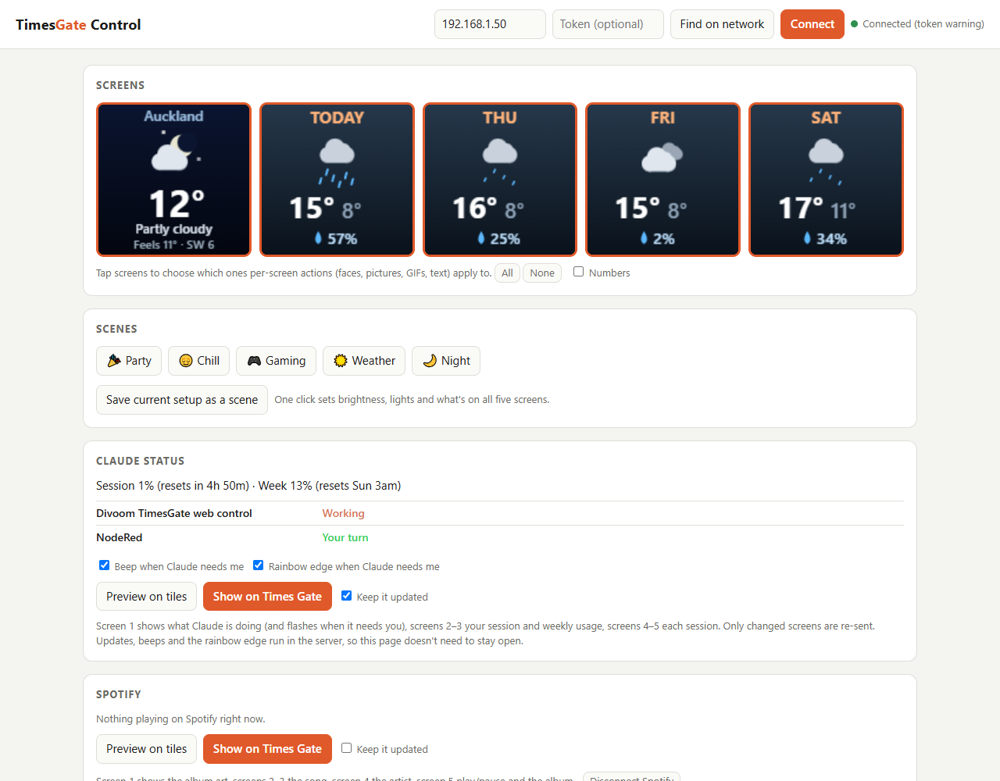
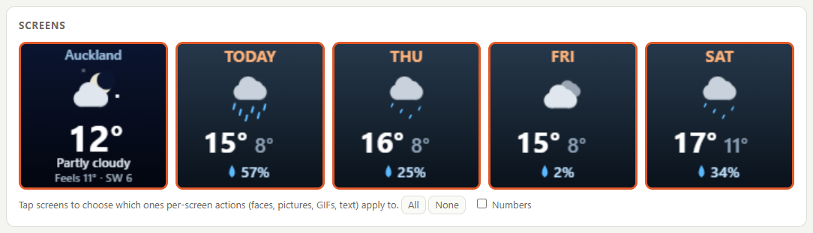
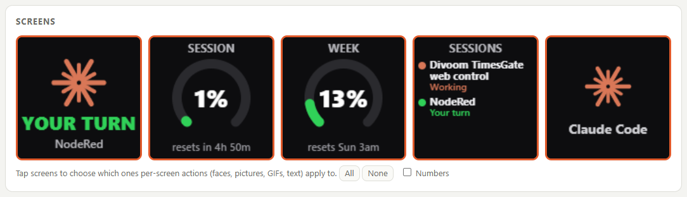
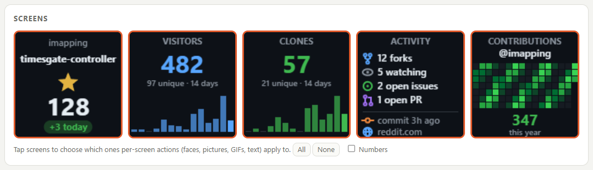
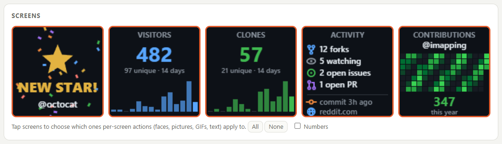
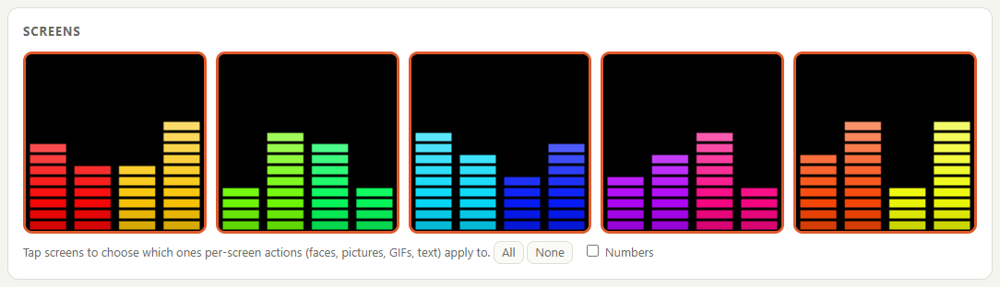
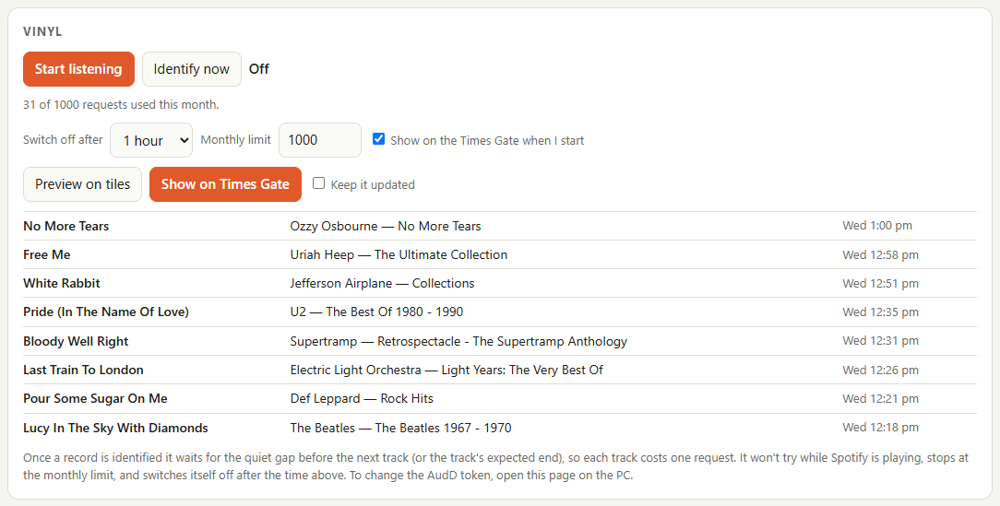
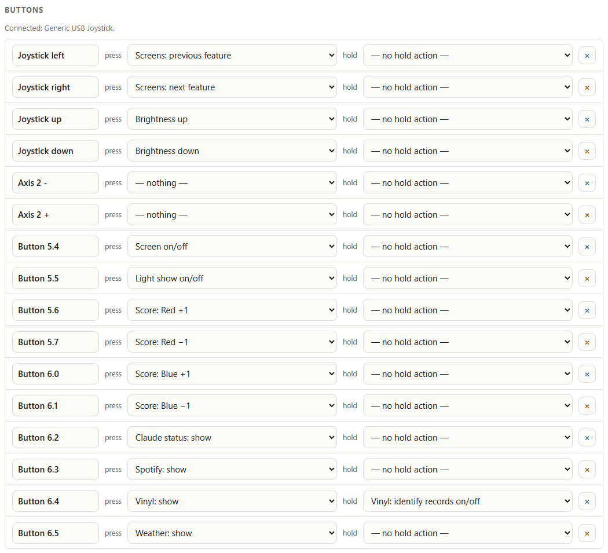
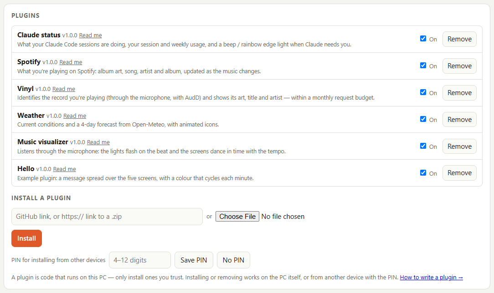
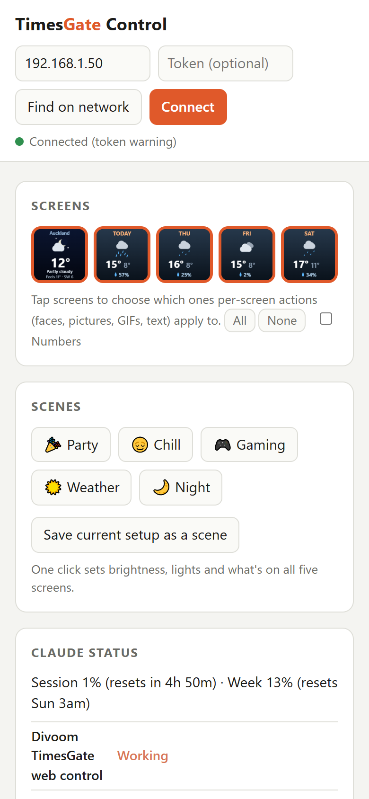

# TimesGate controller

A web controller for the [Divoom Times Gate](https://divoom.com/) (five 128×128 screens), running
as a small Node server on your own network. Use it from a PC or phone browser, and it keeps
working with the page closed.

- Pictures, animations, banners, effects, scenes, a timer, a scoreboard and light shows
- **Plugins** for everything that shows live data. The built-in ones are Weather, Spotify
  now playing, Claude Code status, GitHub repository stats, a music visualizer and vinyl record
  recognition.
  They can be installed or removed from the page.
- A **USB microphone** for the visualizer (beat-synced lights) and for recognising records (AudD)
- A **USB button box** (an arcade joystick kit) or game controller: map each button to any action
- **Several Times Gates**, each with its own screens and settings



## Screenshots

The five screens as the page previews them. **Weather:**



**Claude status:** your turn / working, and session and weekly usage.



**GitHub:** stars, visitors and clones for your repositories, activity, and your contribution
graph (shown here with example numbers):



When a repository gets a new star, fork, issue or pull request, it celebrates with confetti, a beep
and a rainbow edge light:



**Music visualizer:** dances in time with the beat it hears through the microphone.



**Vinyl:** identifies the record that's playing, within a monthly request budget.



**Button box:** give each button a press and a hold action.



**Plugins:** turn them on or off, read their docs, or install new ones from a GitHub link.



It works on a phone too:



## Getting started

### 1. What you need

- A Divoom Times Gate, already set up on your Wi-Fi with the Divoom app.
- A computer that stays on, on the same network: a Windows PC, a Mac, Linux, or a Raspberry Pi.
- [Node.js](https://nodejs.org/) 18 or newer (the LTS download is fine).

### 2. Download it

Either use git:

```bash
git clone https://github.com/imapping/timesgate-controller.git
```

or, without git, click the green **Code** button on GitHub, choose **Download ZIP**, and unzip it
somewhere permanent (for example `C:\TimesGate` or `~/timesgate-controller`).

### 3. Install and start it

Open a terminal in that folder (in Windows Explorer, right-click inside the folder and choose
**Open in Terminal**), then install the two libraries it uses:

```bash
npm install
```

Then start the controller:

```bash
npm start
```

It prints the addresses it's running on. Leave that window open while you use it.

### 4. Connect to your Times Gate

1. Open `http://localhost:8080` in a browser on the same computer.
2. Press **Find on network** and click your Times Gate. This asks Divoom's servers which Divoom
   devices share your internet connection; no account is needed. You can also type the Times
   Gate's IP address (shown in the Divoom app) and press **Connect**.
3. Give the Times Gate a fixed address (a DHCP reservation in your router), so it's always found
   in the same place. Do the same for the computer if you'll use it from a phone.

To use it from a phone, open `http://<the computer's IP>:8080`. On Windows, allow Node.js through
the firewall on **private networks** the first time it asks.

If you have more than one Times Gate, press **Find on network** again and add each one. A picker
appears at the top of the page.

### 5. Keep it running

Everything (keeping screens updated, alerts, buttons, the timer) runs in the controller itself, so
the page doesn't need to stay open, but the controller does.

- **Windows:** to start it automatically when you sign in, run this once from the controller's
  folder in PowerShell (it writes output to `server.log`):

  ```powershell
  $run = New-ScheduledTaskAction -Execute powershell.exe -WorkingDirectory $PWD -Argument '-NoProfile -WindowStyle Hidden -Command "& node server.js *> server.log"'
  Register-ScheduledTask -TaskName "TimesGate Controller" -Action $run -Trigger (New-ScheduledTaskTrigger -AtLogOn -User $env:USERNAME)
  ```

  Run `Start-ScheduledTask "TimesGate Controller"` to start it straight away. To remove it later,
  run `Unregister-ScheduledTask "TimesGate Controller"`.
- **Raspberry Pi or other Linux:** use the installer, which sets it up as a service. See
  [Running on a Raspberry Pi](#running-on-a-raspberry-pi).

### 6. Set up the plugins you want

Each plugin has a **Read me** link in the Plugins card on the page, and its own card. They
all work without setup except:

- **Spotify:** create a free app at the
  [Spotify developer dashboard](https://developer.spotify.com/dashboard), tick **Web API**, and add
  the redirect URI `http://127.0.0.1:8080/api/spotify/callback`. Paste its Client ID into the
  Spotify card and click Connect. Do this on the computer running the controller, because Spotify
  only accepts that `127.0.0.1` address (on a Pi, see [below](#running-on-a-raspberry-pi)).
- **Vinyl:** get an API token from [AudD](https://dashboard.audd.io/) and paste it into the Vinyl
  card (on the computer running the controller). Set a monthly limit to match your plan.
- **Weather:** search for your town in the Weather card.
- **GitHub:** add your repositories in the GitHub card. For visitors and clones, add a
  fine-grained token with **Administration: Read-only** (see the plugin's Read me).
- **Claude status:** tell [Claude Code](https://claude.com/claude-code) to send its events to the
  controller. Add to `~/.claude/settings.json` on the same computer, one entry for each of
  `SessionStart`, `UserPromptSubmit`, `PreToolUse`, `PostToolUse`, `Notification`, `Stop`,
  `StopFailure` and `SessionEnd`:

  ```json
  {
    "hooks": {
      "Notification": [{ "hooks": [{ "type": "http", "url": "http://127.0.0.1:8080/api/claude/hook", "timeout": 2 }] }]
    },
    "statusLine": { "type": "command", "command": "node /path/to/timesgate-controller/claude-statusline.js" }
  }
  ```

  The status line entry is optional. It adds your session and weekly usage.

### 7. Updating

If you used git, run `git pull`, then `npm install`, and restart the controller. If you downloaded
a ZIP, download the new one and copy your `data/` folder and `engine.json` into it. Those hold your
settings, logins and Times Gates.

Optional extras:
- **Microphone:** [ffmpeg](https://ffmpeg.org/) on Windows, or `arecord` (alsa-utils) on Linux.
- **Button box:** set up and tested with a common **USB arcade kit**: a joystick and 10 buttons on a
  DragonRise "zero delay" USB encoder (USB ID `0079:0006`, shown as "Generic USB Joystick"). These
  come in many cheap arcade DIY kits. Other USB gamepads and joysticks should also work: the
  controller reads the raw USB input, so any joystick, D-pad or button just appears on the page when
  pressed, with no setup file to write. It works through `node-hid`, which `npm install` installs.

## Running on a Raspberry Pi

A Raspberry Pi 4 (or a Pi 400, or a Zero 2 W) makes a quiet, always-on home for the controller,
with the USB microphone and button box plugged into it. It has no screen: you use the page from
your PC or phone.

1. **Prepare the SD card** with [Raspberry Pi Imager](https://www.raspberrypi.com/software/):
   - Choose **Raspberry Pi OS Lite (64-bit)**, under *Raspberry Pi OS (other)*.
   - Under **Edit settings**, set the hostname (e.g. `timesgate`), a username and password, and
     your Wi-Fi. Under **Services**, turn on **SSH**.
2. **Start the Pi** with the microphone and button box plugged in. Give it a fixed address (a
   DHCP reservation) in your router.
3. **Connect to it over SSH** from your PC, using your username:

   ```bash
   ssh yourname@timesgate.local
   ```

4. **Run the installer** on the Pi:

   ```bash
   curl -fsSL https://raw.githubusercontent.com/imapping/timesgate-controller/main/scripts/install-pi.sh | bash
   ```

   It installs Node.js, arecord and fonts, sets the controller up as a service that starts at
   boot, and lets it read the button box. It also lets the PC you ran it from change setup and tokens
   (saved in `data/trusted.json`), since nobody sits at the Pi itself. At the end it shows the
   page's address, e.g. `http://timesgate.local:8080`.

   To update later, run the same command again. Your settings are kept.

**Moving from a PC:** stop the controller on the PC so the two don't both drive the Times Gates.
For the Windows task from step 5, that's:

```powershell
Stop-ScheduledTask "TimesGate Controller"; Disable-ScheduledTask "TimesGate Controller"
```

Then copy your settings across from the PC's controller folder, and restart the service on the Pi:

```powershell
scp -r data engine.json yourname@timesgate.local:timesgate-controller/
```

```bash
ssh yourname@timesgate.local sudo systemctl restart timesgate
```

This keeps your Times Gates, plugin settings, Spotify login, tokens and button assignments. The
microphone is picked again automatically.

**Claude status from a PC:** point Claude Code's hooks at the Pi instead of `127.0.0.1`, using its
address in each hook's `url` (e.g. `http://192.168.1.128:8080/api/claude/hook`). The PC must be
listed in the Pi's `data/trusted.json`, which it is if you ran the installer from it. For the status
line, keep `claude-statusline.js` on the PC and tell it where the Pi is, in `~/.claude/settings.json`:

```json
{ "env": { "TIMESGATE_URL": "http://192.168.1.128:8080" } }
```

**Logging in to Spotify on a Pi:** Spotify only sends the login back to `127.0.0.1`. Copying your
settings from a PC keeps an existing login. For a new one, connect with a tunnel so the PC's
`127.0.0.1:8080` reaches the Pi, then open `http://127.0.0.1:8080` on the PC and log in there:

```bash
ssh -L 8080:127.0.0.1:8080 yourname@timesgate.local
```

**Useful commands on the Pi:** `journalctl -u timesgate -f` shows the log, and
`sudo systemctl restart timesgate` restarts it.

## Writing plugins

See [PLUGINS.md](PLUGINS.md), which can also be read from the page, and copy `examples/hello/` to
start. [CLAUDE.md](CLAUDE.md) describes the architecture.

## Third-party services

Some plugins use online services. Each user sets up their own account or key; none are included.

- **Weather:** data by [Open-Meteo.com](https://open-meteo.com/), licensed CC BY 4.0. The free API
  is for non-commercial use.
- **Spotify:** needs your own Client ID from the
  [Spotify developer dashboard](https://developer.spotify.com/dashboard). Use is subject to
  Spotify's developer terms.
- **Vinyl:** uses [AudD](https://audd.io/) music recognition, a paid service with your own API token.
  The plugin only listens on request and has a monthly cap.
- **GitHub:** uses the GitHub API. It works without a token; an optional read-only token of your
  own adds visitors, clones and your contribution graph.
- **Divoom cloud:** used only to find Times Gates on your network, and to list clock faces.

Settings, logins and tokens are saved in `data/`, which is never served by the web server and is
excluded from git.

## Disclaimer

This is an unofficial project, not affiliated with or endorsed by Divoom, Spotify, AudD or
Anthropic. Divoom and Times Gate are trademarks of Divoom; Spotify is a trademark of Spotify AB;
Claude is a trademark of Anthropic.

## License

[MIT](LICENSE) © 2026 Gary Nicholson

The dependencies are also permissively licensed: `@napi-rs/canvas` (MIT, bundles Skia, BSD-3),
`node-hid` (MIT/X11, with hidapi used under its BSD licence), `node-addon-api` and
`pkg-prebuilds` (MIT). ffmpeg and arecord are separate programs. They are not included and are
only run when needed.
