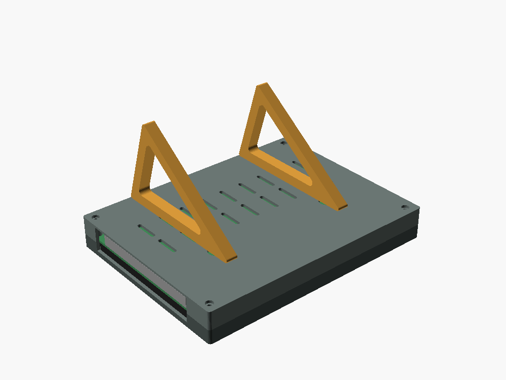

# Screen case

A 3D-printed case for the Duinotech XC9026 7" HDMI touch screen (a "7inch HDMI LCD(H)" board), used as
the TimesGate's Now Playing display. It can stand on a desk or shelf, leaning back 18°, or hang on a wall.

Outside size: **170 × 129 × 22 mm**.



| File | Print | Notes |
|---|---|---|
| `bezel.stl` | 1, face down | The front frame. Holds the screen at its four corner tabs. |
| `back.stl` | 1, back down | The back cover, with vents and two keyhole slots. |
| `fin.stl` | 2, flat | The stand. Each fin hooks into a keyhole. Leave them off to hang it on a wall. |
| `screen-case.scad` | | The OpenSCAD source. Every measurement is a named number at the top. |

It's drawn with the picture upright and the orange ribbon edge at the bottom, as the screen is used on
the Pi. The sockets are on the right and the menu buttons on the left.

## Printing

- PLA or PETG, 0.2 mm layers, 3 walls, 15–20% infill. No supports needed.
- The bezel prints with its front on the bed, so the front comes out smooth. A textured sheet gives
  it a matte finish.
- Print the fins in PETG if you have it: the hooks carry the screen's weight.

## Hardware

- 4 × **M2.5 × 16 mm** screws (pan head). They go in from the back, through the board's corner tabs,
  and cut their own thread in the bezel's posts. Don't over-tighten. Machine screws or self-tapping
  screws both work.
- For the wall: 2 screws, 90 mm apart and level, with heads 7–9 mm across, left standing about 3 mm out.

## Assembly

1. Lay the bezel face down and drop the screen in, glass first. Its tabs sit on the four posts.
2. Put the back on. The side with the big opening goes over the sockets.
3. Screw the four corners from the back.
4. **To stand it:** push each fin's hook into a keyhole's round end, then slide the fin up into the
   slot. Stand it on the fins and the case's bottom edge.
5. **To hang it:** put the keyholes over the wall screws and let it drop into the slots.

The menu buttons (exit, down/right, up/left, menu, power) are reached through the slot in the left
side, with a fingernail or a pen. You'll rarely need them.

## If something doesn't fit

The measurements were taken with a ruler, so a few may be out by half a millimetre. Change the number
at the top of `screen-case.scad` and render that part again:

```
openscad -D 'part="bezel"' -o bezel.stl screen-case.scad
openscad -D 'part="back"'  -o back.stl  screen-case.scad
openscad -D 'part="fin"'   -o fin.stl   screen-case.scad
```

- **The glass presses on the bezel, or rattles:** `K` (glass + LCD thickness) or `glassGap`.
- **The screen is too tight or too loose side to side:** `fit`.
- **The window shows the black border or cuts into the picture:** the borders `C`–`F`, or `win_m`.
- **The screw holes don't line up:** `S`, `G` and `H`.
- **A plug won't seat:** the socket opening in `side_cuts()`.
- **A different lean:** `tilt`, then print new fins.

`part="assembly"` shows everything together, and `part="section"` shows a slice through the right-hand
screws.
